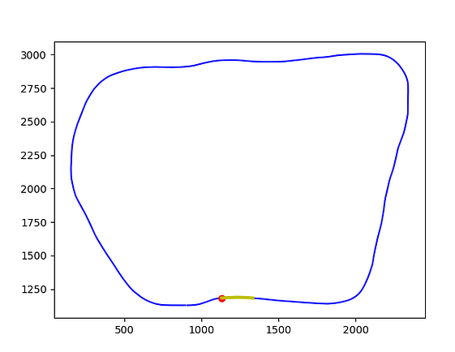
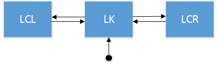
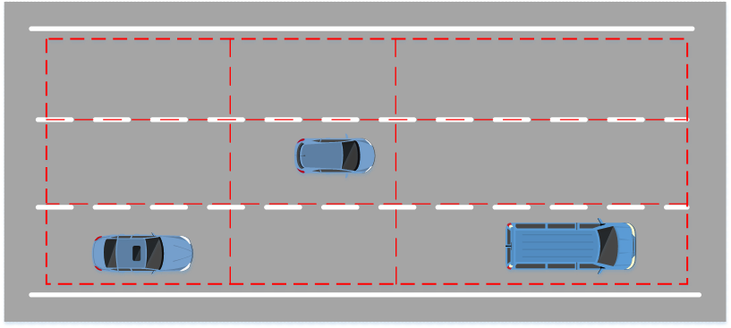
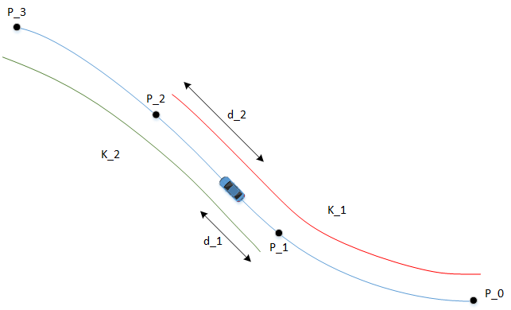

# Udacity Self-driving Car Nanodegree
## Term 3 - Project 11
# Path Planning Project
---

## Build and Run Instruction
It is advised to create a separate build directory, e.g., `build/`, before launching cmake and make.
The program can then be launched by typing in `/path_planning`.
Make sure that the Udacity term 3 simulator for the path planning project is running in the background.

## Introduction
The aim of this project is to write a path planner for the term 3 simulator. The basic scenario is a simulated non-exit 3-lane highway with intermediate traffic density. The outline of the highway is as follows (source of plot: Udacity forum):

In order to help the car navigate along the highway, 42 predefined waypoints are given and listed in `data/highway_map.csv`.
Although the dimensions are never really clarified, it assumed that the waypoint-coordinates are measured in meters.

## Behavior Planner
The Behavior Planner is based on the principle that it plans a trajectory of a fixed distance of  ahead of the ego vehicle ( = 90 meters).

#### State Machine
The state machine is very primitive and consists of only three states:

* LC - Lane Keep
* LCL - Lane Change Left
* LCR - Lane Change Right

The next figure illustrates the state machine:

State transitions can only occur when the ego vehicle has traversed the preplanned trajectory, and are based on a cost-function system. This is certainly not a very realistic concept, but it deals with the limitations of the simulator. It would be desirable to enable the vehicle to evaluate its state every predefined time interval (such as every 20 ms). This seems to require some trickery with the simulator and should be possible, but is unfortunately out of the scope at the time of this writing.

State transitions are evaluated as follows: Depending on the current lane the ego vehicle resides (stored in the variable `current_lane`), two or three trajectories are created. On or two for lane changes and one for staying on the lane. The trajectory constructor receives - apart from the obvious ego vehicle kinematics - information on the average traffic speed in each lane.

Each of the trajectory candidates is then evaluated by the cost functions as described below. The trajectory with the lowest costs will be the next to be pursued.

#### Cost Functions
The state machine has two different cost functions:

* `cost_function_traffic()`
* `cost_function_behavior()`

Of these to, we shall mainly focus on `cost_function_traffic()`, as the second one is designed relatively straightforward and follows the study material offered in the lessons.

As indicated in the following figure, subdivide the road in front of the vehicle (and to some extend also behind) into "buckets":

A for-loop iterates over all cars in the proximity of the ego vehicle (these where already pre-filtered in a loop in the `main()`-function) and places them into a bucket.
Each bucket has a certain cost. For example, cars farer away from the ego-vehicle are given a lower cost, and vehicles in the proximity of the ego vehicle are given a higher cost.

The advantage of this "bucket-approach" seems to be much less dependency on the cost-functions' weight, and therefore less need for fine-tuning. Also, the complexity of the operation is significantly less than other approaches like tracing the trajectories of the target vehicles.

#### Trajectory Generation
The trajectories are modeled as instances of the `Trajectory`-class. For modeling a jerk-minimizing trajectory, I have utilized quintic polynomials which minimize the functional

and satisfy the boundary conditions as required.

The Trajectory class' constructor accepts values such as the total time 
as input as well as initial and final positions, and initial and final longitudinal velocities. Note that the final longitudinal velocity is calculated by the state machine using the available traffic data.

The total time ensures that the mean speed along the interior of the trajectory stays in a range defined by the initial and final velocities. E.g., choosing  relatively large leads to the ego vehicle first decelerating and then accelerating again. Choosing  relatively large leads to the ego vehicle first accelerating and then decelerating again.

## Analysis
### Failed attempts
Since there were only relatively little guidelines for this project, the students had perhaps more freedom to explore individual solutions than in other projects of the SDC-ND. This lead us to experimenting with several different solutions and eventually abandoning them after several hours of research.

**Stochastic trajectory generation**
By this I mean choosing random endpoints for the trajectories and choosing the one with the lowest costs. The problem with this approach is that while it worked in principle, it has eaten too many computational resources.

**Calculating cost of trajectory**
I.e. predicting the movement of each target vehicle and calculating collision trajectories. Again, this methods has taken too many CPU cycles. Calculating a few dozen trajectories in advance has taken several seconds.

## Possible Modifications
Although the current solution enables the ego vehicle to navigate through the traffic, it is far from optimal. I therefore suggest further modifications:

One possible modification which I have only shortly delved into is the possibility to enable near real-time path planning akin to the MPC project. It seems like this requires some delicate fine-tuning, as the vehicle behaves rather rough when one attempts to modify the trajectory each time the state machine is called from the main-loop.

One state which I wish to add - if such a modification is possible - is an *emergency abort* which returns the vehicle into a safe state (like returning into the original lane) whenever a unforeseen situation arises, e.g. when getting too close to a target vehicle.

## Comment on the Provided Framework
Most students I have communicated with share the same opinion that fixing the boilerplate code was quite distracting from the primary objective of developing a reliable path planner. There are at least two main issues which require attention before the path planner can be attacked.

1. Putting the complete code into `main.cpp` seemed to be rather inconvenient for such a relatively complex project. Also, the usage of classes appears rather naturally from the project and using separate files for each class is therefore mandatory.

2. The `getXY()` function for translating *Frenet* into *Cartesian* coordinates was unsuitable for transforming the quintic curve  into Cartesian coordinates. Its original implementation relied on a simple linear interpolation between the track's 42 waypoints, which resulted in piecewise polynomial trajectories after a quintic polynomial in Frenet coordinates has been translated into Cartesian coordinates.

**Ad 1.)** First of all, instead of relying on a single `main.cpp`-file, I chose to split the code into several different files. These are (omitting header files):

* `main.cpp`: Contains the main loop which communicates with the simulator.
* `statemachine.cpp`: Contains the state machine and cost functions.
* `trajectory.cpp`: Contains the `Trajectory`-class. An instance of `Trajectory` is
* `common.cpp`: A collection of functions, such as the affine coordinate transformations `global2local()` and `local2global()` which are used when creating splines.
* `maptool.cpp`: `Maptool`-class which can be considered as a singleton. Its members are useful functions such as `getXY()` and `getFrenet()`.

**Ad 2.)** Development of a new `getXY_spline()` method which targets the non-smoothness issues above. [The section below](#The-getXY-Function) is dedicated to this question.

## The getXY()-Function
The `getXY()`-function is of critical importance. As described above, it had to be modified in order to become useful. Our approach is based on the following idea:
Let 
be four adjacent waypoints, where  and  are the next two waypoints in front of the ego vehicle, and  and  the next two behind (cf. the illustration below).

Denote by  the spline generated by the three points

(red line in the illustration), and by

the spline generated by
 (green line).
Note that the two splines are in general not identical in the section between points 
and
.
The two splines will be interpolated within the interval between these points as follows:

Let  and  be the s-distance of the car to  and , respectively. In order to find a smooth approximation for the whole track, define the following weights:
 and .
Then define further:

The interpolated XY-position is then defined as:

In order to understand the meaning of this expression, consider again the diagram above: The ego vehicle is by definition located in between the two points  and . As it continues to drive forward, the distance to , becomes larger, i.e. ),
and the distance to  becomes smaller, i.e. .
So for the interpolated position:

since

and
.

We see that the contribution of the first spline, , is zero when the ego vehicle located at . As soon as the ego vehicle crosses this point,  is deleted from the list of waypoints, and the next point ahead of  is added. If the new list of points is

,

then , , and .

The interpolation is can be done with new splines  and  where .

* The interpolation algorithm makes use of an interesting idea by fellow *Udacity SDC-ND student* [Piermarco Pascale][1].  He proposed the interpolation formula together with a quadratic polynomial approximation and determines the true arc-length by integrating the curve described by the polynomial.
While his approach is incredibly accurate, it is - due to it's computational complexity - too slow for practical purposes. I modified the approach by exchanging the polynomials with splines and the integration part with an approximation of the arc-length. For a detailed description of algorithm, cf. the description below.

* As for he spline library, I make use of the [library by Tino Kluge][2], as suggested in the lectures. It picks the closest two map points in front of the ego vehicle, and the closest two map points behind it. It then generates two spline curves between the first three points and the last three points.

## Conclusion
Although the project was extremely interesting, the largest portion of time had to be dedicated to secondary objectives. These included trying out new architectures for the code and rewriting helper functions, especially the notorious `getXY()`-function.
One lesson I have learned is that computational complexity is a huge issue when developing path-planning algorithms for self-driving cars. Concepts which have been introduced in the lectures like, for example, stochastic trajectory generation seem to be unfeasible for usage in the simulator.

At the time of submission, I have not been fully satisfied by the architecture I have developed.

***

*Machine setup:*
* Intel i5-6500 CPU
* 16GB RAM
* Nvidia GTX 1060 GPU, 6GB VRAM
* Linux Mint 18 (based on Ubuntu 16.04 LTS)

***
The latex-graphics were generated by https://www.codecogs.com/eqnedit.php.

[1]: https://discussions.udacity.com/t/a-more-refined-getxy-function/666827
[2]: http://kluge.in-chemnitz.de/opensource/spline/
